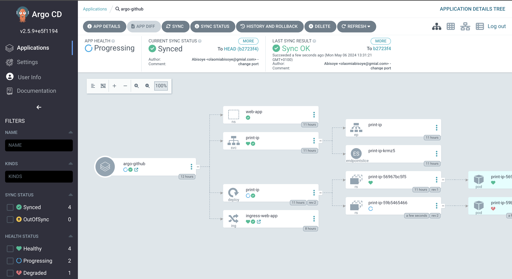

<!-- BEGIN_TF_DOCS -->
## Requirements

| Name | Version |
|------|---------|
|  [aws](#requirement\_aws) | 5.44.0 |
|  [helm](#requirement\_helm) | 2.13.1 |

## Providers

| Name | Version |
|------|---------|
|  [aws](#provider\_aws) | 5.44.0 |
|  [external](#provider\_external) | n/a |
|  [helm](#provider\_helm) | 2.13.1 |
|  [kubernetes](#provider\_kubernetes) | n/a |

## Modules

| Name | Source | Version |
|------|--------|---------|
|  [containers](#module\_containers) | ../modules/containers/eks | n/a |
|  [docker\_repository](#module\_docker\_repository) | ../modules/containers/ecr | n/a |
|  [networking](#module\_networking) | ../modules/networking/vpc | n/a |

## Resources

| Name | Type |
|------|------|
| [aws_iam_openid_connect_provider.main](https://registry.terraform.io/providers/hashicorp/aws/5.44.0/docs/resources/iam_openid_connect_provider) | resource |
| [aws_iam_policy.controller](https://registry.terraform.io/providers/hashicorp/aws/5.44.0/docs/resources/iam_policy) | resource |
| [aws_iam_role.oidc](https://registry.terraform.io/providers/hashicorp/aws/5.44.0/docs/resources/iam_role) | resource |
| [aws_iam_role_policy_attachment.main](https://registry.terraform.io/providers/hashicorp/aws/5.44.0/docs/resources/iam_role_policy_attachment) | resource |
| [helm_release.argocd](https://registry.terraform.io/providers/hashicorp/helm/2.13.1/docs/resources/release) | resource |
| [helm_release.eks-chart](https://registry.terraform.io/providers/hashicorp/helm/2.13.1/docs/resources/release) | resource |
| [kubernetes_manifest.argo-github](https://registry.terraform.io/providers/hashicorp/kubernetes/latest/docs/resources/manifest) | resource |
| [kubernetes_manifest.service-account](https://registry.terraform.io/providers/hashicorp/kubernetes/latest/docs/resources/manifest) | resource |
| [aws_availability_zones.available](https://registry.terraform.io/providers/hashicorp/aws/5.44.0/docs/data-sources/availability_zones) | data source |
| [aws_caller_identity.current](https://registry.terraform.io/providers/hashicorp/aws/5.44.0/docs/data-sources/caller_identity) | data source |
| [aws_eks_cluster.main](https://registry.terraform.io/providers/hashicorp/aws/5.44.0/docs/data-sources/eks_cluster) | data source |
| [aws_eks_cluster_auth.main](https://registry.terraform.io/providers/hashicorp/aws/5.44.0/docs/data-sources/eks_cluster_auth) | data source |
| [aws_region.current](https://registry.terraform.io/providers/hashicorp/aws/5.44.0/docs/data-sources/region) | data source |
| [external_external.thumbprint](https://registry.terraform.io/providers/hashicorp/external/latest/docs/data-sources/external) | data source |

## Inputs

| Name | Description | Type | Default | Required |
|------|-------------|------|---------|:--------:|
|  [access\_key](#input\_access\_key) | n/a | `string` | `""` | no |
|  [desired\_size](#input\_desired\_size) | n/a | `number` | `1` | no |
|  [image\_tag\_mutability](#input\_image\_tag\_mutability) | n/a | `string` | `"MUTABLE"` | no |
|  [instance\_types](#input\_instance\_types) | n/a | `list(any)` | <pre>[   "t3.medium" ]</pre> | no |
|  [max\_size](#input\_max\_size) | n/a | `number` | `5` | no |
|  [max\_unavailable](#input\_max\_unavailable) | n/a | `number` | `1` | no |
|  [min\_size](#input\_min\_size) | n/a | `number` | `0` | no |
|  [product](#input\_product) | company name | `string` | `"deel"` | no |
|  [region](#input\_region) | n/a | `string` | `"us-west-2"` | no |
|  [scan\_on\_push](#input\_scan\_on\_push) | n/a | `bool` | `true` | no |
|  [secret\_key](#input\_secret\_key) | n/a | `string` | `""` | no |
|  [service](#input\_service) | Name of the ECR repository | `string` | `"print-ip"` | no |
|  [subnet\_type](#input\_subnet\_type) | n/a | `string` | `"public"` | no |
|  [subnets\_cidr](#input\_subnets\_cidr) | list of private subnets id | `list(string)` | <pre>[   "10.100.20.0/24",   "10.100.21.0/24",   "10.100.22.0/24" ]</pre> | no |
|  [vpc\_cidr](#input\_vpc\_cidr) | n/a | `string` | `"10.100.0.0/16"` | no |

## Outputs

| Name | Description |
|------|-------------|
|  [availability\_zones](#output\_availability\_zones) | n/a |
<!-- END_TF_DOCS -->

ArgoCD Dashboard

